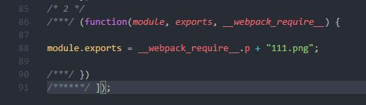

### [file-loader](https://doc.webpack-china.org/loaders/file-loader/#-)

指示webpack以文件的形式发出所需的对象，并返回其公共URL

````javascript
module.exports = {
  module: {
    rules: [
      {
        test: /\.(png|jpg|gif)$/,
        use: [
          {
            loader: 'file-loader',
            options: {}
          }
        ]
      }
    ]
  }
}
````

运行步骤:

1. npm install
2. webpack

