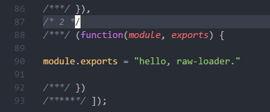

### raw-loader

一个用于webpack的加载器，它允许您以字符串的形式导入文件.

```javascript
module.exports = {
  module: {
    rules: [
      {
        test: /\.txt$/,
        use: 'raw-loader'
      }
    ]
  }
}
```

运行步骤：

1. npm install
2. webpack


